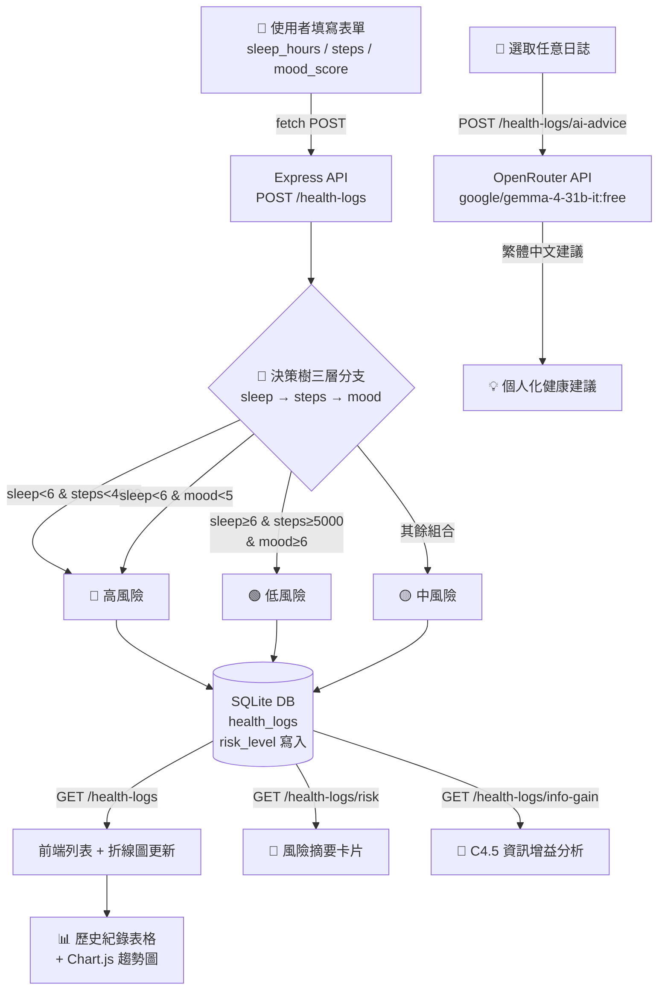

# 🏥 智慧健康日誌與風險評估系統

> 期末黑客松 — 題目 A  
> 技術棧：Node.js · Express · SQLite · Sequelize · OpenRouter AI  
> **備註：後端依題目說明文件規範，採用 Node.js + Express 實作**

---

## 📁 專案架構

```
HealthDiary/
├── server.js          # 後端主程式（Express API + 決策樹 + 資訊增益 + AI 串接）
├── public/
│   └── index.html     # 前端單頁應用（純 HTML + Vanilla JS + Chart.js）
├── package.json       # 套件設定（含 start script）
├── .env               # 環境變數（不上傳 GitHub）
├── .gitignore         # 忽略設定
├── database.sqlite    # SQLite 資料庫（本機，不上傳）
└── 對話紀錄.md        # AI 協作完整對話紀錄
```

---

## 🔄 四大板塊協作說明

### 1. 前端（Frontend）— `public/index.html`

單一 HTML 檔案，使用原生 JavaScript `fetch()` 呼叫後端 API。主要功能包含：
- **新增日誌表單**：填入睡眠時數、步數、心情分數（滑桿），送出後即時顯示決策樹評估結果
- **統計卡片**：顯示總筆數、高風險天數、中風險天數、低風險天數
- **風險徽章**：以綠（低）/ 黃（中）/ 紅（高）三色視覺呈現風險等級
- **Chart.js 趨勢折線圖**：睡眠、步數、心情三條折線，支援四種切換模式，顯示最近 30 筆趨勢
- **歷史紀錄列表**：表格顯示所有日誌，每筆可單獨取得 AI 建議或刪除
- **AI 健康建議**：呼叫後端 AI 端點，針對指定日誌取得個人化建議文字
- **資訊增益分析**：一鍵呼叫 C4.5 計算，顯示各特徵 IG 值與最佳門檻比較卡片
- **決策樹邏輯說明**：頁面底部展示完整三層決策樹結構

### 2. 後端（Backend）— `server.js`

Express RESTful API 伺服器，提供以下端點：

| 方法   | 路徑                       | 功能                              |
|--------|----------------------------|-----------------------------------|
| GET    | `/health-logs`             | 取得所有健康日誌（依日期倒序）    |
| POST   | `/health-logs`             | 新增日誌（自動計算 risk_level）   |
| PUT    | `/health-logs/:id`         | 修改指定日誌（重新計算風險）      |
| DELETE | `/health-logs/:id`         | 刪除指定日誌                      |
| GET    | `/health-logs/risk`        | 回傳最新一筆的風險等級            |
| GET    | `/health-logs/info-gain`   | C4.5 資訊增益計算，回傳各特徵最佳門檻與排序 |
| POST   | `/health-logs/ai-advice`   | 呼叫 OpenRouter AI 取得個人化健康建議 |
| POST   | `/health-logs/seed`        | 載入 90 天模擬種子資料（三種風險分布） |

### 3. 資料庫（Database）— SQLite + Sequelize

資料表 `health_logs` 結構：

| 欄位          | 型態    | 限制        | 說明                         |
|---------------|---------|-------------|------------------------------|
| `id`          | INTEGER | PRIMARY KEY AUTOINCREMENT | 每筆紀錄唯一識別碼 |
| `log_date`    | DATE    | NOT NULL    | 紀錄日期（YYYY-MM-DD）       |
| `sleep_hours` | REAL    | NOT NULL    | 睡眠時數                     |
| `steps`       | INTEGER | NOT NULL    | 當日步數                     |
| `mood_score`  | INTEGER | NOT NULL    | 心情分數（1–10）             |
| `risk_level`  | TEXT    | 可為空      | 風險等級（由決策樹計算後寫入，非種子資料）|

資料庫路徑依環境自動判斷：
- 本機：`./database.sqlite`
- Railway 部署：`/data/database.sqlite`（掛載 Volume，資料持久化）

### 4. AI 模組（AI Module）— OpenRouter × Gemma

透過 `openai` 套件串接 **OpenRouter**，固定使用 `google/gemma-4-31b-it:free` 免費模型。接收指定日誌的健康數據與風險等級後，生成個人化繁體中文健康建議（約150字）。可從歷史列表任意選取一筆日誌進行分析，不限於最新紀錄。

---

## 🌲 決策樹設計（三層分支）

系統採用三層決策樹，依**資訊增益（C4.5）**排序以睡眠 → 步數 → 心情作為分支依據。**每一筆資料都必須走完三層**，不存在早期退出路徑：

```
Level 1：sleep_hours < 6h?
├─ YES → Level 2：steps < 4000?
│        ├─ YES → Level 3：mood_score < 5?
│        │        ├─ YES → 🔴 高風險（三項全差）
│        │        └─ NO  → 🔴 高風險（睡眠+活動嚴重不足）
│        └─ NO  → Level 3：mood_score < 5?
│                 ├─ YES → 🔴 高風險（睡眠差+心情差）
│                 └─ NO  → 🟡 中風險（睡眠差但活動+心情尚可）
└─ NO  → Level 2：steps < 5000?
         ├─ YES → Level 3：mood_score < 5?
         │        ├─ YES → 🟡 中風險（活動少+心情差）
         │        └─ NO  → 🟢 低風險（睡眠好，心情佳）
         └─ NO  → Level 3：mood_score < 6?
                  ├─ YES → 🟡 中風險（睡眠/活動好但心情欠佳）
                  └─ NO  → 🟢 低風險（三項指標皆良好）
```

---

## 🧮 資訊增益（C4.5 進階）

系統內建 C4.5 資訊增益計算功能（`GET /health-logs/info-gain`）：
1. 讀取資料庫所有已分類紀錄
2. 對 `sleep_hours`、`steps`、`mood_score` 三個特徵窮舉所有中間點
3. 計算每個門檻值的資訊增益：`IG = Entropy(S) - Σ weighted_entropy`
4. 找出各特徵最佳門檻值，依 IG 排序決定最佳切分順序
5. 驗證「睡眠時數」資訊增益最高，與決策樹設計一致

---

## 🗺️ 資料流架構圖（Mermaid）



---

## 🌱 種子資料說明

系統內建 `POST /health-logs/seed` 端點，一鍵載入 90 天模擬健康日誌，刻意安排三種規律分布：

| 分組 | 天數 | sleep_hours | steps | mood_score | 決策樹結果 |
|------|------|-------------|-------|------------|-----------|
| 高風險組 | 25天 | 3.5–5.0h | 900–3,500 | 1–3 | 🔴 高 |
| 中風險組 | 40天 | 5.5–7.0h | 3,500–6,300 | 3–5 | 🟡 中 |
| 低風險組 | 25天 | 7.0–9.0h | 6,500–9,800 | 8–9 | 🟢 低 |

資料有明顯規律（非純隨機），確保決策樹每個分支都有足夠案例。

**種子資料設計與驗證過程：**

種子資料依題目規格要求，手動設計三種分布組合，確保高風險組數值極端（睡眠 ≤ 5h、步數 ≤ 3500、心情 ≤ 3）、低風險組數值明顯優良（睡眠 ≥ 7h、步數 ≥ 6500、心情 ≥ 8），中風險組數值混合介於兩者之間，與題目 2.3 建議的種子資料規律一致。

載入後透過 `GET /health-logs` API 實際驗證：
- 確認三種 `risk_level`（高/中/低）都有足夠案例（高風險約37筆、中風險約28筆、低風險約20筆）
- 確認高風險組的 `sleep_hours`、`steps`、`mood_score` 數值確實偏低
- 確認低風險組的三項數值確實偏高
- 確認資料規律真實存在，非純隨機，決策樹每個分支都有案例（詳見 AI 對話紀錄 對話27）

---

## 🚀 本機啟動

```bash
# 1. 安裝套件
npm install

# 2. 設定環境變數（填入 OpenRouter API Key）
# 編輯 .env，將 OPENROUTER_API_KEY= 後面換成真實 Key
# 免費申請：https://openrouter.ai/keys

# 3. 啟動伺服器
npm start

# 4. 開啟瀏覽器
# http://localhost:3000
```

---

## ☁️ Railway 部署

1. 推上 GitHub（Public Repo）
2. Railway → New Project → Deploy from GitHub repo
3. Variables → 加入 `OPENROUTER_API_KEY`（不需加 PORT）
4. New → Volume → Mount Path `/data`（資料持久化，必須在 Generate Domain 之前）
5. Settings → Networking → Generate Domain
6. 部署完成後前往網址，點「載入種子資料」初始化資料庫
