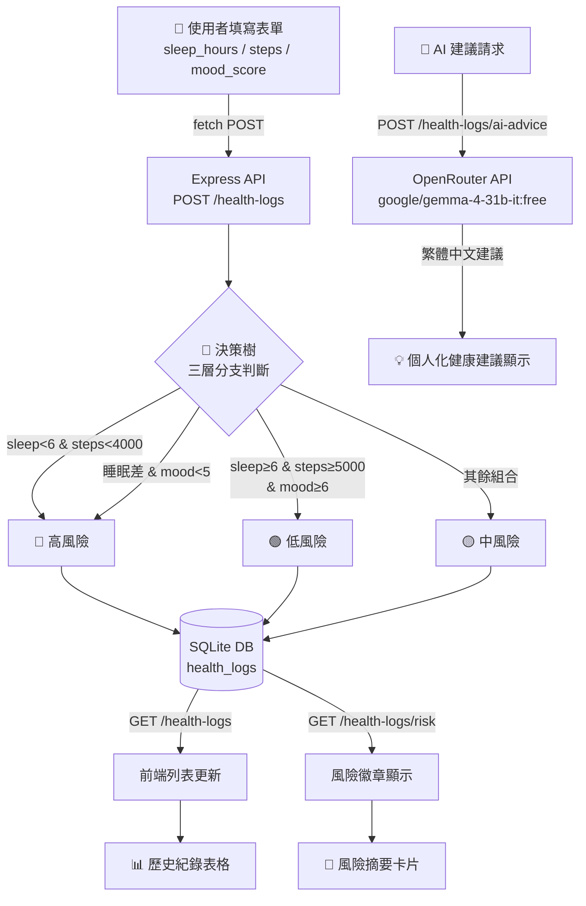

# 🏥 智慧健康日誌與風險評估系統

> 期末黑客松 — 題目 A  
> 技術棧：Node.js · Express · SQLite · Sequelize · OpenRouter AI

---

## 📁 專案架構

```
HealthDiary/
├── server.js          # 後端主程式（Express API + 決策樹 + AI 串接）
├── public/
│   └── index.html     # 前端單頁應用（純 HTML + Vanilla JS）
├── package.json       # 套件設定（含 start script）
├── .env               # 環境變數（不上傳 GitHub）
├── .gitignore         # 忽略設定
├── database.sqlite    # SQLite 資料庫（本機，不上傳）
└── 對話紀錄.md        # AI 協作完整對話紀錄
```

---

## 🔄 四大板塊協作說明

### 1. 前端（Frontend）— `public/index.html`

單一 HTML 檔案，使用原生 JavaScript `fetch()` 呼叫後端 API。主要功能包含：
- **新增日誌表單**：填入睡眠時數、步數、心情分數（滑桿），送出後即時顯示決策樹評估結果
- **風險徽章**：以綠（低）/ 黃（中）/ 紅（高）三色視覺呈現風險等級
- **歷史紀錄列表**：表格顯示所有日誌，支援刪除操作
- **AI 健康建議**：呼叫後端 AI 端點，取得個人化建議文字

### 2. 後端（Backend）— `server.js`

Express RESTful API 伺服器，提供以下端點：

| 方法   | 路徑                      | 功能                              |
|--------|---------------------------|-----------------------------------|
| GET    | `/health-logs`            | 取得所有健康日誌（依日期倒序）    |
| POST   | `/health-logs`            | 新增日誌（自動計算 risk_level）   |
| PUT    | `/health-logs/:id`        | 修改指定日誌（重新計算風險）      |
| DELETE | `/health-logs/:id`        | 刪除指定日誌                      |
| GET    | `/health-logs/risk`       | 回傳最新一筆的風險等級            |
| POST   | `/health-logs/ai-advice`  | 呼叫 AI 取得個人化健康建議        |
| POST   | `/health-logs/seed`       | 載入 90 天模擬種子資料            |

### 3. 資料庫（Database）— SQLite + Sequelize

資料表 `health_logs` 結構：

| 欄位          | 型態    | 說明                         |
|---------------|---------|------------------------------|
| `id`          | INTEGER | 主鍵，自動遞增               |
| `log_date`    | DATE    | 紀錄日期（YYYY-MM-DD）       |
| `sleep_hours` | REAL    | 睡眠時數                     |
| `steps`       | INTEGER | 當日步數                     |
| `mood_score`  | INTEGER | 心情分數（1–10）             |
| `risk_level`  | TEXT    | 風險等級（由決策樹計算後寫入）|

資料庫路徑依環境自動判斷：本機使用 `./database.sqlite`，Railway 部署使用 `/data/database.sqlite`（掛載 Volume）。

### 4. AI 模組（AI Module）— OpenRouter × Gemma

透過 `openai` 套件串接 **OpenRouter**，固定使用 `google/gemma-4-31b-it:free` 模型。接收使用者健康數據後，依風險等級生成個人化繁體中文健康建議。

---

## 🌲 決策樹設計（三層分支）

系統採用三層決策樹，依**資訊增益**排序分別以睡眠 → 步數 → 心情作為分支依據：

```
睡眠 < 6h?
├─ YES → 步數 < 4000?
│        ├─ YES → 🔴 高風險（睡眠差 + 活動嚴重不足）
│        └─ NO  → 心情 < 5?
│                 ├─ YES → 🔴 高風險（睡眠差 + 心情極差）
│                 └─ NO  → 🟡 中風險（睡眠差但其他尚可）
└─ NO  → 步數 < 5000?
         ├─ YES → 心情 < 5?
         │        ├─ YES → 🟡 中風險（活動少且心情差）
         │        └─ NO  → 🟢 低風險（睡眠好，活動少但心情佳）
         └─ NO  → 心情 < 6?
                  ├─ YES → 🟡 中風險（睡眠/活動OK但心情欠佳）
                  └─ NO  → 🟢 低風險（三項指標皆良好）
```

---

## 🗺️ 資料流架構圖（Mermaid）



---

## 🚀 本機啟動

```bash
# 1. 安裝套件
npm install

# 2. 設定環境變數（填入 OpenRouter API Key）
# 編輯 .env，將 OPENROUTER_API_KEY= 後面換成真實 Key

# 3. 啟動伺服器
npm start

# 4. 開啟瀏覽器
# http://localhost:3000
```

---

## ☁️ Railway 部署

1. 推上 GitHub（Public Repo）
2. Railway → New Project → Deploy from GitHub repo
3. Variables → 加入 `OPENROUTER_API_KEY`
4. New → Volume → Mount Path `/data`
5. Settings → Generate Domain
